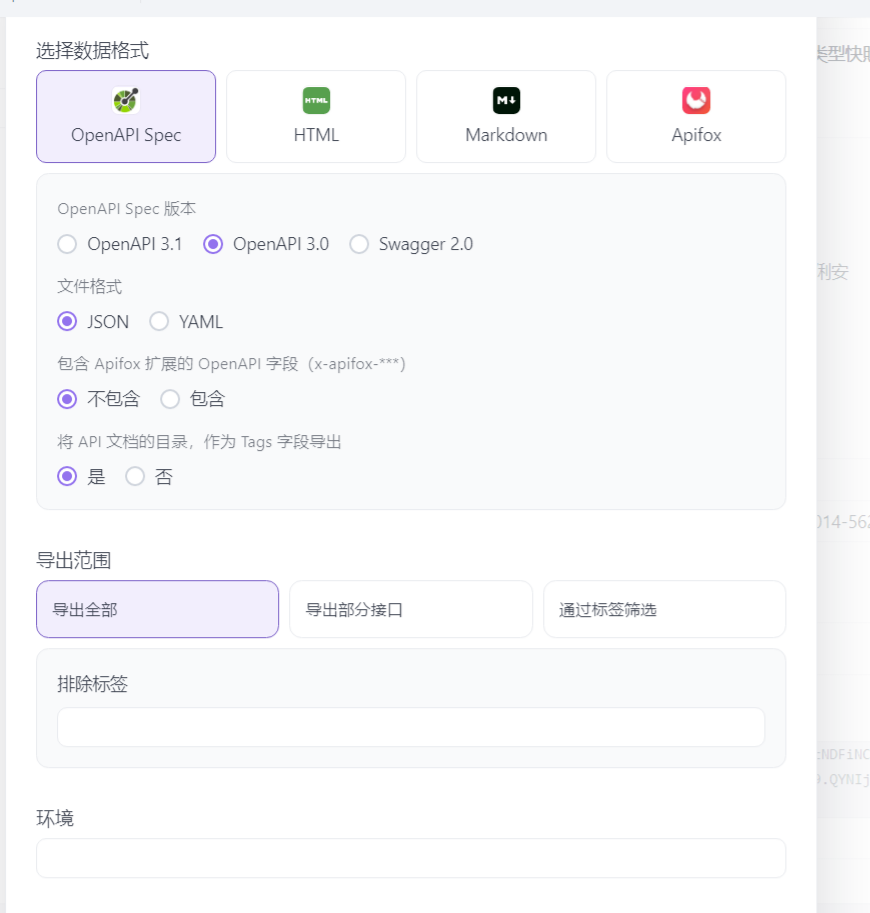
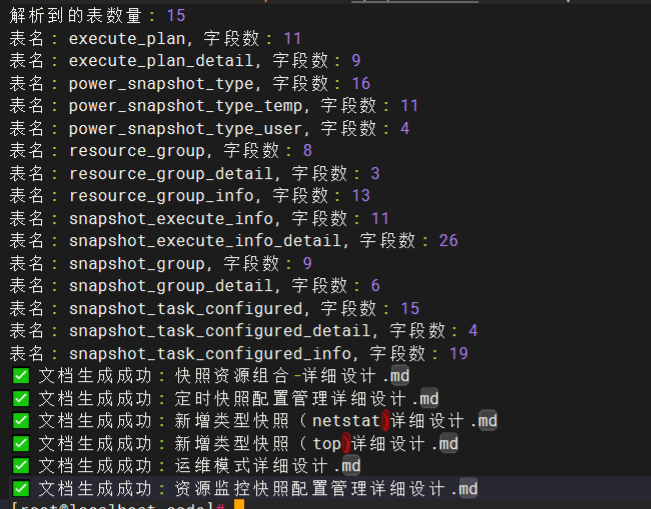

# 数据准备

## config.json

titile: 详设标题

function_summary：详设说明

output_file：生成文件名

apis：该详细设计接口路径和请求类型

tables：该详细设计设计到的表名

```
 [
    {
        "title": " 详细设计",
        "function_summary": "详细设计描述",
        "output_file": "详细设计.md",
        "apis": [
            {
                "api_url": "/api/rest/v1/resource-group",
                "method": "POST"
            }
        ],
        "tables": ["table1"]
    } 
    }
]
```

openapi.json

在apifox导出文件




## 执行


```
登录服务器
#进入目录
cd /opt/app/target/code
 
#说明 python3 docs.python --openapi 《导出的api.json文件》 --host <开发环境数据库地址> --port <开发环境数据库端口> --user <开发环境数据库账号> --password <开发环境数据库密码> --db <详设对应数据库名> --config <详设对应conf.json文件名> --output-dir 《导出文件夹》


```

效果：
 

自动上传md到conflunce

```

#设置账号密码
export CONFLUENCE_USERNAME='知识库账号'
export CONFLUENCE_API_KEY='知识库密码'
export CONFLUENCE_ORGNAME='知识库地址'
#执行上传
# sh send2conf.sh 《md文件路径》 《空间标识》 《父目录名称》
sh send2conf.sh snapshot/ SPC 快照中心详细设计

```

#下载目录下文件到指定目录

```
# python3 download_confluence_pages.py 《导出路径》 《空间标识》 《父目录名称》
python3 download_confluence_pages.py word SPC "详细设计"
```

